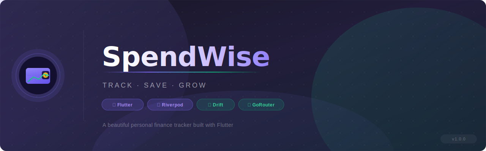
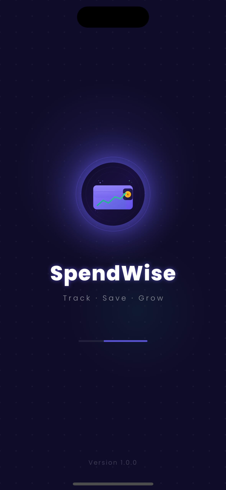
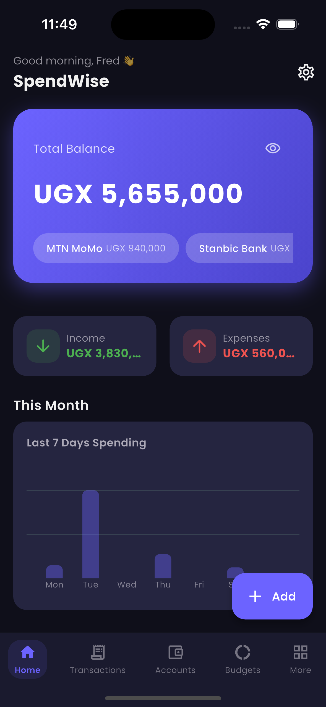
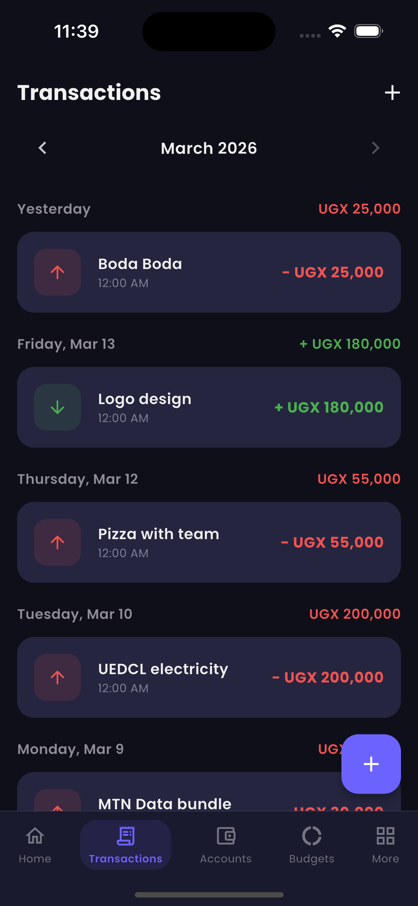
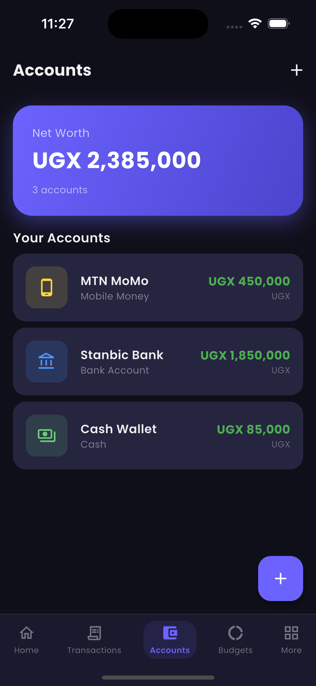
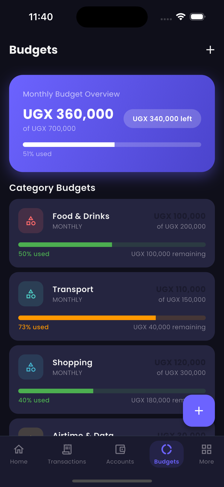
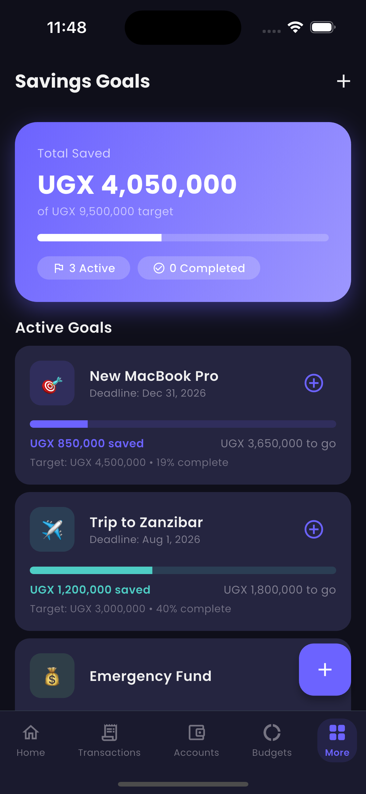
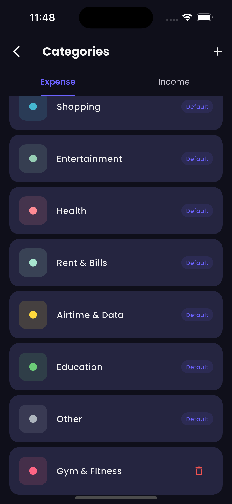
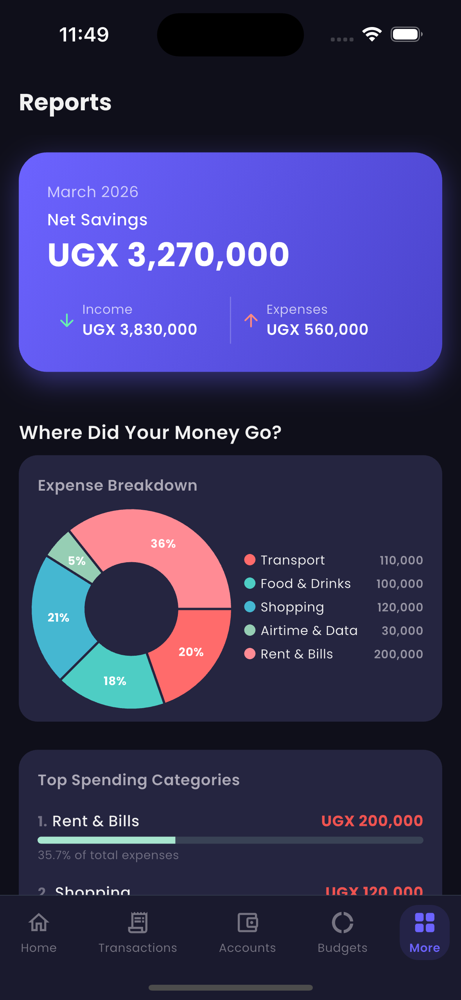
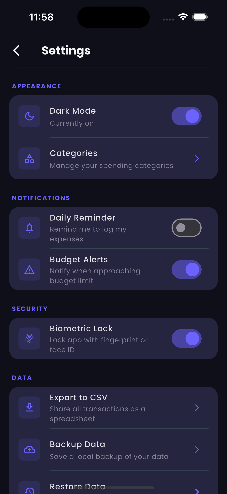

<div align="center">



<br/>

[](https://flutter.dev)
[](https://dart.dev)
[](https://riverpod.dev)
[](LICENSE)
[]()

<br/>

**A beautiful, fully offline personal finance tracker built with Flutter.**  
Track your income and expenses, manage accounts, set budgets, and grow your savings — all in one place, with your data never leaving your device.

<br/>

</div>

---

## ✨ Features

| Category | Details |
|---|---|
| 💰 **Transactions** | Log income & expenses with categories, notes, and dates |
| 🏦 **Accounts** | Manage multiple accounts (cash, bank, mobile money) |
| 📊 **Budgets** | Set monthly category budgets with real-time alerts |
| 🎯 **Goals** | Create savings goals and track your progress |
| 📈 **Reports** | Visual spending charts and financial summaries |
| 🔔 **Notifications** | Daily reminders & budget overspend alerts |
| 🔐 **Biometric Lock** | Fingerprint / Face ID app protection |
| 🌙 **Dark Mode** | Full dark & light theme support |
| 🗂 **Categories** | Fully customizable spending categories |
| 📤 **Export** | Export all transactions to CSV and share via any app |

---

## 📱 Screenshots

| Splash | Dashboard | Transactions |
|--------|-----------|--------------|
|  |  |  |

| Accounts | Budgets | Goals |
|----------|---------|-------|
|  |  |  |

| Categories | Reports | Settings |
|------------|---------|----------|
|  |  |  |

---

## 🏗 Architecture

SpendWise follows a clean, feature-first architecture with a clear separation of concerns.

```
lib/
├── main.dart
├── app.dart                          # App root, theme & router wiring
│
├── core/
│   ├── constants/                    # Colors, strings, sizes
│   ├── extensions/                   # DateTime & double helpers
│   ├── router/
│   │   └── app_router.dart           # GoRouter with biometric & onboarding guards
│   ├── theme/                        # Light & dark ThemeData
│   └── utils/                        # Currency & date formatters
│
├── database/
│   ├── app_database.dart             # Drift DB definition
│   ├── tables/                       # Transactions, accounts, categories, budgets, goals
│   └── daos/                         # Type-safe query objects per table
│
├── features/
│   ├── splash/                       # Animated motion splash screen
│   ├── onboarding/                   # First-run setup flow
│   ├── dashboard/                    # Balance card, recent transactions, spending chart
│   ├── transactions/                 # Full transaction CRUD
│   ├── accounts/                     # Account management
│   ├── budgets/                      # Budget creation & progress tracking
│   ├── goals/                        # Savings goals
│   ├── reports/                      # Charts & financial reports
│   ├── categories/                   # Category management
│   └── settings/                     # App settings, lock screen
│
└── shared/
    ├── widgets/                      # Reusable UI components
    └── models/
        └── app_result.dart           # Success/Failure wrapper
```

**Key patterns used:**
- **Feature-first** folder structure — each feature is self-contained with `data/`, `domain/`, `presentation/`, and `providers/`
- **Repository pattern** — data sources abstracted behind repository classes
- **AsyncNotifier** from Riverpod 3 — for all async state management
- **GoRouter** with `refreshListenable` — stable router that re-evaluates guards without recreating itself

---

## 🛠 Tech Stack

| Layer | Technology |
|---|---|
| **UI Framework** | [Flutter](https://flutter.dev) 3.x |
| **State Management** | [Flutter Riverpod](https://riverpod.dev) 3.x |
| **Navigation** | [GoRouter](https://pub.dev/packages/go_router) 17.x |
| **Local Database** | [Drift](https://drift.simonbinder.eu) (SQLite, type-safe) |
| **Authentication** | [local_auth](https://pub.dev/packages/local_auth) 3.x (Fingerprint / Face ID) |
| **Notifications** | [flutter_local_notifications](https://pub.dev/packages/flutter_local_notifications) 21.x |
| **Animations** | [flutter_animate](https://pub.dev/packages/flutter_animate) |
| **Charts** | [fl_chart](https://pub.dev/packages/fl_chart) |
| **Fonts** | [Google Fonts](https://pub.dev/packages/google_fonts) (Poppins) |
| **Persistence** | [shared_preferences](https://pub.dev/packages/shared_preferences) |
| **Code Generation** | [Freezed](https://pub.dev/packages/freezed) + [Drift Dev](https://pub.dev/packages/drift_dev) |

---

## 🚀 Getting Started

### Prerequisites

- Flutter SDK `>=3.x`
- Dart SDK `>=3.11.1`
- Android Studio / Xcode (for device deployment)

### Installation

1. **Clone the repository**
   ```bash
   git clone https://github.com/EngFred/spendwise.git
   cd spendwise
   ```

2. **Install dependencies**
   ```bash
   flutter pub get
   ```

3. **Run code generation** (required for Drift & Freezed)
   ```bash
   dart run build_runner build --delete-conflicting-outputs
   ```

4. **Generate app icons**
   ```bash
   dart run flutter_launcher_icons
   ```

5. **Run the app**
   ```bash
   flutter run
   ```

---

## ⚙️ Android Setup

Ensure `android/app/src/main/kotlin/.../MainActivity.kt` extends `FlutterFragmentActivity` (required for biometric auth):

```kotlin
import io.flutter.embedding.android.FlutterFragmentActivity

class MainActivity : FlutterFragmentActivity()
```

The following permissions are declared in `AndroidManifest.xml`:

```xml
<uses-permission android:name="android.permission.POST_NOTIFICATIONS"/>
<uses-permission android:name="android.permission.SCHEDULE_EXACT_ALARM"/>
<uses-permission android:name="android.permission.USE_EXACT_ALARM"/>
<uses-permission android:name="android.permission.USE_BIOMETRIC"/>
<uses-permission android:name="android.permission.USE_FINGERPRINT"/>
<uses-permission android:name="android.permission.RECEIVE_BOOT_COMPLETED"/>
```

---

## 🍎 iOS Setup

The following keys are required in `ios/Runner/Info.plist`:

```xml
<key>NSFaceIDUsageDescription</key>
<string>SpendWise uses Face ID to keep your financial data secure.</string>
```

---

## 🗺 Navigation Flow

```
App Launch
    │
    ▼
[/splash] ──────────────────────────────────────────────────────────┐
    │                                                                │
    ├─ Onboarding incomplete? ──► [/onboarding] ──► [/dashboard]    │
    │                                                                │
    ├─ Biometric lock enabled? ──► [/lock] ──► [/dashboard]         │
    │                                                                │
    └─ All clear? ───────────────► [/dashboard]                     │
                                                                     │
         [/dashboard]  [/transactions]  [/accounts]                  │
         [/budgets]    [/goals]         [/reports]    ◄──────────────┘
              ▲
              │ ShellRoute (bottom nav)
```

---

## 🔐 Security

- **Biometric authentication** is handled by `local_auth` v3 using device-native APIs (Fingerprint, Face ID, device PIN fallback)
- The **session unlock state** is held in memory only (`sessionUnlockedProvider`) — never persisted to disk
- The app automatically locks when backgrounded (`AppLifecycleObserver`) and requires re-authentication on resume
- All financial data is stored **locally on device** using SQLite via Drift — no cloud sync, no data leaves the device

---

## 📦 Project Dependencies

<details>
<summary>Click to expand full dependency list</summary>

```yaml
dependencies:
  flutter_riverpod: ^3.3.1
  go_router: ^17.1.0
  drift: ^2.32.0
  sqlite3_flutter_libs: ^0.6.0+eol
  freezed_annotation: ^3.1.0
  json_annotation: ^4.11.0
  intl: ^0.20.2
  uuid: ^4.5.3
  flutter_local_notifications: ^21.0.0
  permission_handler: ^12.0.1
  local_auth: ^3.0.1
  share_plus: ^12.0.1
  path_provider: ^2.1.5
  csv: ^7.2.0
  shared_preferences: ^2.5.4
  google_fonts: ^8.0.2
  fl_chart: ^1.2.0
  flutter_animate: ^4.5.2
  lottie: ^3.3.2
  flutter_svg: ^2.2.4
  gap: ^3.0.1
  timezone: ^0.11.0

dev_dependencies:
  drift_dev: ^2.32.0
  freezed: ^3.2.5
  json_serializable: ^6.13.0
  build_runner: ^2.12.2
  flutter_launcher_icons: ^0.14.3
```

</details>

---

## 🤝 Contributing

Contributions are welcome! Please follow these steps:

1. Fork the repository
2. Create your feature branch: `git checkout -b feature/amazing-feature`
3. Commit your changes: `git commit -m 'feat: add amazing feature'`
4. Push to the branch: `git push origin feature/amazing-feature`
5. Open a Pull Request

Please make sure your code follows the existing architecture patterns and passes `flutter analyze` with no warnings.

---

## 📋 Roadmap

- [x] CSV export
- [ ] Local data backup & restore
- [ ] Recurring transactions
- [ ] Multi-currency conversion
- [ ] Widget (home screen balance card)
- [ ] iCloud / Google Drive backup
- [ ] Debt tracker

---

## 📄 License

This project is licensed under the MIT License — see the [LICENSE](LICENSE) file for details.

---

<div align="center">

Built with ❤️ using Flutter

**[⭐ Star this repo](https://github.com/EngFred/spendwise)** if you found it useful!

</div>